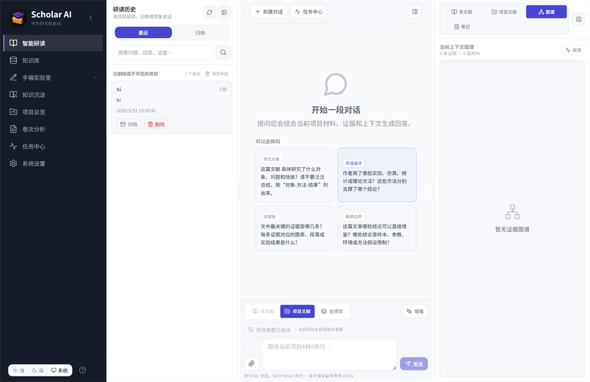
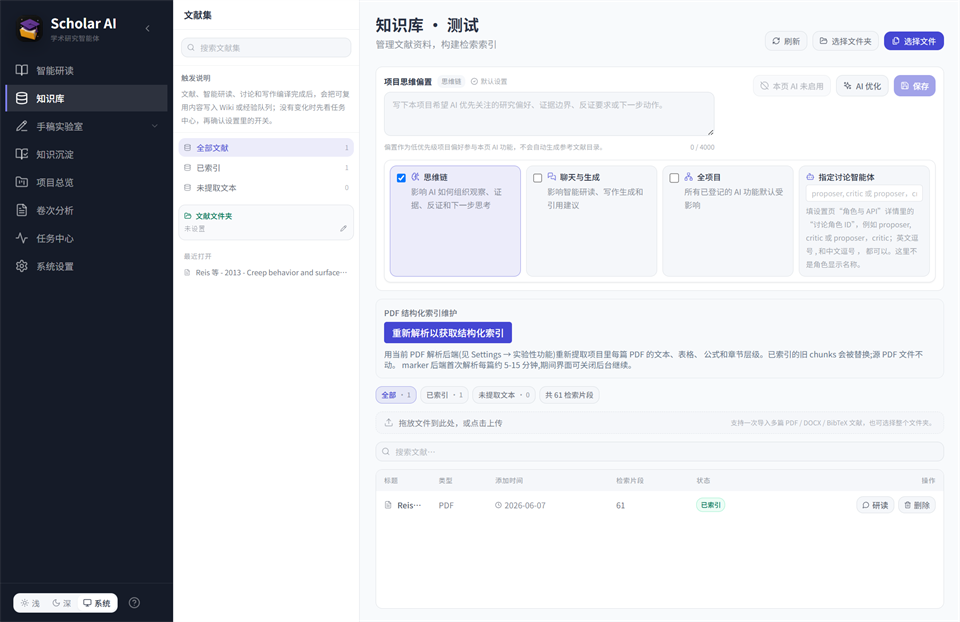
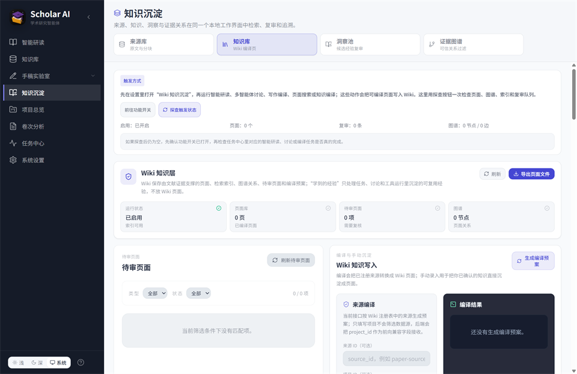
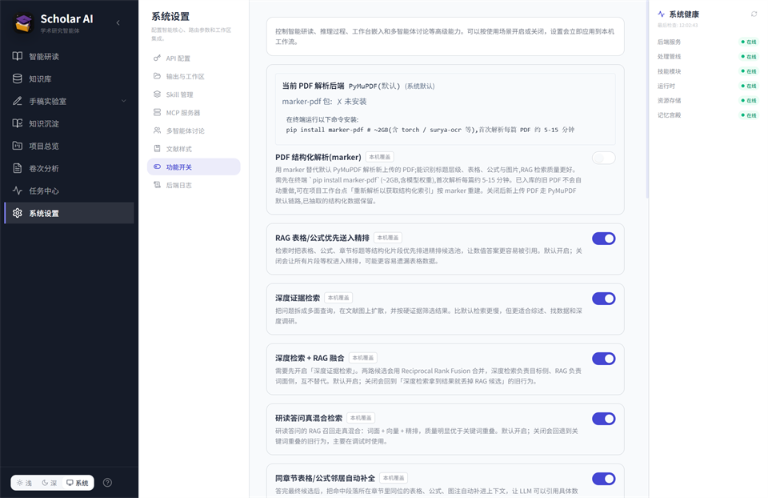

# Scholar AI

Scholar AI 是一个本地优先的学术研究工作台，面向需要长期阅读 PDF、围绕同一课题反复追问、整理证据并写成文稿的研究流程。它把文献库、PDF 阅读、RAG 问答、多角色讨论、Wiki 知识沉淀、写作编辑器和 MCP 工具调用放在同一个桌面应用里。

当前源码版本 [v0.1.8.4](CHANGELOG.md#0184---2026-06-17) ·
[本地文献 MCP 工具箱](agent_mcp_server/README.md) ·
[从源码运行](#从源码运行)

> 当前方向是源码工作区 + 本地 MCP 工具箱。Claude、Codex 等支持 MCP 的客户端可以直接调用文献助手能力，也可以在安全边界内查看源码和复用工作流。

## 界面预览

<table>
  <tr>
    <td width="50%"><strong>智能研读</strong><br></td>
    <td width="50%"><strong>知识库</strong><br></td>
  </tr>
  <tr>
    <td width="50%"><strong>Wiki 工作台</strong><br></td>
    <td width="50%"><strong>设置与功能开关</strong><br></td>
  </tr>
</table>

## 适合什么场景

- 读几十到上百篇 PDF，并持续围绕同一课题追问。
- 需要答案带页码级引用，能回到原文核验。
- 需要把临时问答、讨论结论和证据沉淀成长期知识库。
- 需要从证据检索走到论文写作，而不是在多个工具间复制粘贴。
- 希望研究资料、日志、对话和索引默认留在本机。

## 核心能力

| 能力 | 当前实现 |
|---|---|
| PDF 阅读 | 内嵌 PDF.js 阅读器，多标签页、连续滚动、页码跳转、高亮、便签和阅读位置保存 |
| 文献库 | 项目级文献管理，上传 PDF 后切块、去重、索引，支持绑定源文件夹后按需或全量入库 |
| 智能研读 | 统一问答入口，结合 RAG、目标导向检索和 rerank，回答带证据引用 |
| 检索链路 | 关键词检索、向量检索、重排序和目标导向检索共同工作，提升长文献问答的召回质量 |
| 结构化证据补全 | 表格、公式、图注和同章节相邻证据会一起进入上下文，减少“提到表格但没给真数据”的情况 |
| 多角色讨论 | 多个角色围绕同一问题讨论、质询、补证据并形成综合结论 |
| Wiki 知识沉淀 | 可把材料、观点和复审后的发现沉淀为本地 Wiki 页面 |
| 写作 | TipTap 富文本编辑器，大纲、引用、图表资料和 DOCX 导出链路 |
| MCP / Skill | 文献助手内置 MCP / Skill 扩展；源码版额外提供给 Claude / Codex 使用的本地文献工具箱 |
| 设置与日志 | API、模型、凭证、实验功能和后端日志查看器集中在设置页 |

## 0.1.8.4 重点

- 新增本地文献 MCP 工具箱，Claude、Codex 等支持 MCP 的客户端可以从源码工作区调用文献检索、材料读取、导出、审计和工作流工具。
- MCP 工具箱提供安全源码查看能力，外部智能体可以读取允许范围内的文献助手源码，用于理解接口、复用工作流和辅助修复工具问题；凭证、运行时状态和工作区私有数据仍在保护边界外。
- 新增 Agent Workspace，用于查看 MCP 工具调用审计、工作流产物和临时输出，避免外部智能体任务混入文献助手自己的任务中心。
- PDF 阅读器增加 `raw1` 读取路径，降低下载管理器拦截内嵌 PDF 请求导致空白或 204 响应的概率。

## 获取与使用

0.1.8.4 以源码工作区为主：先启动文献助手，再把 `agent_mcp_server/` 配置给 Claude、Codex 或其他支持 MCP 的客户端。

- [从源码运行文献助手](#从源码运行)
- [配置 Claude / Codex 本地 MCP 工具箱](agent_mcp_server/README.md)
- [查看 0.1.8.4 更新记录](CHANGELOG.md#0184---2026-06-17)

## 架构

```text
┌──────────────────────────────────────────────────────────────────────┐
│ Frontend                                                             │
│ React + Vite + TypeScript + TipTap + PDF.js                          │
│ 桌面工作台、PDF 阅读、写作编辑器和设置页面                              │
└───────────────────────────────┬──────────────────────────────────────┘
                                │ HTTP / SSE / OpenAPI
┌───────────────────────────────▼──────────────────────────────────────┐
│ Backend                                                              │
│ FastAPI + Pydantic v2                                                │
│ 文献入库、聊天问答、Wiki、写作、MCP、设置、日志和模型配置 API            │
└───────┬───────────────────────┬──────────────────────┬───────────────┘
        │                       │                      │
        ▼                       ▼                      ▼
  Project storage          Retrieval engine        Extension system
  SQLite / JSONL           PyMuPDF extraction       MCP / Skill scanner
  chunk store              chunking + embedding     credential binding
  runtime state            keyword/vector search    approval gate
  backend logs             rerank + evidence merge  audit records
        │                       │                      │
        └───────────────┬───────┴──────────────┬───────┘
                        ▼                      ▼
                  Research workflow        Writing workflow
                  SmartRead / discussion   TipTap editor
                  evidence references      citation resources
                  Wiki / Evolution         DOCX export
```

### 前端

- `frontend/src/App.tsx` 定义桌面工作台路由，主要页面包括智能研读、知识库、项目、Wiki、写作、任务和设置。
- `frontend/vite.config.ts` 在开发模式下代理后端 API，并从 `workspace_artifacts/runtime_state/api-port.json` 读取实际后端端口。
- 同一个代理还会读取本地访问令牌，并在开发请求中自动附加，匹配后端本地 API 保护机制。
- OpenAPI schema 由 `scripts/export_openapi_schema.py` 导出，前端通过 `openapi-typescript` 生成 `frontend/src/generated/openapi.ts`。

### 后端

- ASGI 入口是 `literature_assistant.core.python_adapter_server:app`。
- `literature_assistant/bootstrap.py` 负责启动时路径注册，保证从源码运行和打包后运行都能加载同一套后端代码。
- 业务 API 位于 `literature_assistant/core/routers/`，覆盖资源入库、聊天、Wiki、写作、MCP、凭证、设置、日志、模型配置和功能开关。
- 本地 API 默认启用访问令牌。健康检查可以直接访问，真实业务请求需要携带运行时生成的本机令牌。
- `agent_mcp_server/` 提供给 Claude / Codex 等 MCP 客户端使用的本地文献工具箱，通过 HTTP 调用文献助手后端，不直接读取用户凭证。

### 数据与运行时状态

- 安装版数据集中在 `%APPDATA%\LiteratureAssistant\`。
- 源码运行数据集中在 `workspace_artifacts/`，其中 `runtime_state/` 放端口、能力令牌、日志和运行时配置，项目资料和切块索引按项目分目录保存。
- 文献切块使用 JSONL / SQLite 等本地文件结构；日志写入 `backend.log` 并在设置页可查看。

### 检索与问答链路

- PDF 默认用 PyMuPDF 抽取文本；marker 结构化解析保留为实验能力，默认关闭。
- 入库后形成 chunk store，并按项目维护文献、页码、chunk 类型、章节和证据引用信息。
- 召回链路包括关键词检索、向量检索、重排序、目标导向检索和结果融合。
- 表格、公式、图注和同章节相邻证据会被优先补入最终上下文，减少只引用段落、不引用真实数据的问题。
- 云端 embedding / rerank 是默认路线。

### 写作、Wiki 与扩展

- 写作区使用 TipTap 富文本编辑器，引用、图表资料和导出能力由后端 writing router 支持。
- Wiki / Evolution 用于把问答、讨论和写作中出现的可复用发现沉淀为本地知识。
- MCP / Skill 包从本地路径扫描，不自动执行包内代码；绑定凭证和启用后，工具调用仍经过审批和审计。
- 源码版附带 `agent_mcp_server/`，可把文献助手作为本地 MCP 工具箱暴露给 Claude / Codex：它默认走本机 HTTP API，工具输出统一脱敏并写入审计日志。

### MCP 工具箱

- `agent_mcp_server/` 是给外部智能体使用的本地工具层，通过 stdio MCP 对接 Claude / Codex。
- 工具箱默认通过本机 HTTP API 调用文献助手后端，不直接读取用户 API key。
- 源码工具受路径白名单和输出脱敏保护，调用记录会写入 Agent Workspace 审计日志。

## 从源码运行

0.1.8.4 面向源码运行和本地 MCP 接入。先启动桌面应用，再按 `agent_mcp_server/README.md` 配置 Claude / Codex。

### 第一步：准备环境

需要：

- Python 3.11
- Node.js 20+
- Windows PowerShell

### 第二步：创建虚拟环境并安装后端依赖

```powershell
py -3.11 -m venv .venv-1
.\.venv-1\Scripts\python.exe -m pip install --upgrade pip
.\.venv-1\Scripts\python.exe -m pip install -e ".[desktop,packaging,dev]"
.\.venv-1\Scripts\python.exe -m pip install -r requirements-ci.txt
```

### 第三步：安装并构建前端

```powershell
cd frontend
npm ci
npm run build
```

前端构建会生成桌面窗口加载的静态页面。命令执行完后，回到仓库根目录再启动桌面应用。

### 第四步：启动桌面应用

```powershell
cd <REPO_ROOT>
.\.venv-1\Scripts\python.exe .\start_desktop.py
```

也可以双击 `start.bat`。它只是 Windows 便捷入口，会优先使用 `.venv-1\Scripts\python.exe` 启动同一个 `start_desktop.py`。

`start_desktop.py` 是推荐的源码启动方式：同一个 Python 进程里，FastAPI 后端跑在后台线程，pywebview 桌面窗口跑在主线程。关闭窗口后进程退出，不需要用户分别管理前后端。

### 可选：只调试后端 API

调试接口时可以不打开桌面窗口，只启动后端：

```powershell
.\.venv-1\Scripts\python.exe -m uvicorn literature_assistant.core.python_adapter_server:app --host 127.0.0.1 --port 8000
```

### 可选：开发前端页面

改前端代码时，可以保留后端运行，再另开一个 PowerShell 启动 Vite：

```powershell
cd frontend
npm run dev
```

这种开发模式才会有两个进程：一个后端进程，一个 Vite 前端开发服务器。Vite 代理会读取 `workspace_artifacts/runtime_state/api-port.json` 中的后端端口，并自动附加本地 API 访问令牌。正常使用源码版时不需要启动 Vite。

### 常用检查命令

```powershell
.\.venv-1\Scripts\python.exe .\run_literature_assistant.py paths
.\.venv-1\Scripts\python.exe -m compileall -q literature_assistant run_literature_assistant.py sitecustomize.py tests\conftest.py
.\.venv-1\Scripts\python.exe -m pytest tests --collect-only -q

cd frontend
npm run lint
npm run build
```

打包脚本保留在仓库中用于历史发布和本地验证，但 0.1.8.4 的主入口是源码工作区和本地 MCP 工具箱。

## 公开源码结构

| 路径 | 说明 |
|---|---|
| `literature_assistant/` | Python 后端、RAG、Wiki、写作、MCP、Skill、Evolution 运行时 |
| `agent_mcp_server/` | 面向 Claude / Codex 的本地文献 MCP 工具箱、配置模板和测试 |
| `frontend/` | React / Vite 桌面工作台 |
| `extension_packages/skills/` | 可选 Scholar AI Skill 包，包根目录需有 `SKILL.md` |
| `extension_packages/mcp/` | 可选 MCP 包，包根目录需有 `literature-mcp.json` 或 `lit-mcp.json` |
| `packaging/` | PyInstaller spec、Inno Setup 脚本和品牌资源 |
| `scripts/` | 构建、发布校验、回填和运维脚本 |
| `tests/` | 后端、检索、安全、打包和前端相关回归测试 |

根目录里保留的几个入口文件是当前源码运行和兼容性需要：

| 文件 | 用途 |
|---|---|
| `start_desktop.py` | 源码桌面启动器，单进程启动后端线程和 pywebview 窗口 |
| `start.bat` | Windows 双击启动入口，内部调用 `start_desktop.py` |
| `run_literature_assistant.py` | 路径诊断和命令行包装入口 |
| `sitecustomize.py` | 兼容从仓库根目录直接运行时的 Python 导入路径 |
| `requirements-ci.txt` | CI 和回归测试依赖锁定 |
| `requirements-pin.txt` | 发布/复现用的完整依赖版本参考 |

## 隐私与凭证

- 研究资料、对话、索引、Wiki、日志默认写在本机。
- 第三方 API key 不写入前端 localStorage，不在日志和 API 响应中明文显示。
- 普通桌面使用优先在「设置」里配置 API 凭证；`.env.example` 只作为源码运行、CI 和临时测试的模板。
- MCP 工具调用前需要用户确认；高风险能力会被阻断或进入审批流。
- 给 Claude / Codex 使用的本地 MCP 工具箱只能读取允许范围内的源码和工作流产物；工具返回前会统一脱敏，调用记录写入 Agent Workspace 审计日志。
- 研究资料、对话、索引和日志默认留在本机。

## 可选扩展

从源码运行时，可以按需启用 marker-pdf 结构化解析、本地 rerank 和本地 embedding。相关依赖需要开发者自行安装。详见 [docs/OPTIONAL_ADDONS.md](docs/OPTIONAL_ADDONS.md)。

## 许可

Scholar AI 项目代码使用 MIT License。第三方开源组件仍适用各自许可证。详见 [LICENSE](LICENSE)。

## 反馈

- [报告安全问题](SECURITY.md)
- [查看贡献说明](CONTRIBUTING.md)
